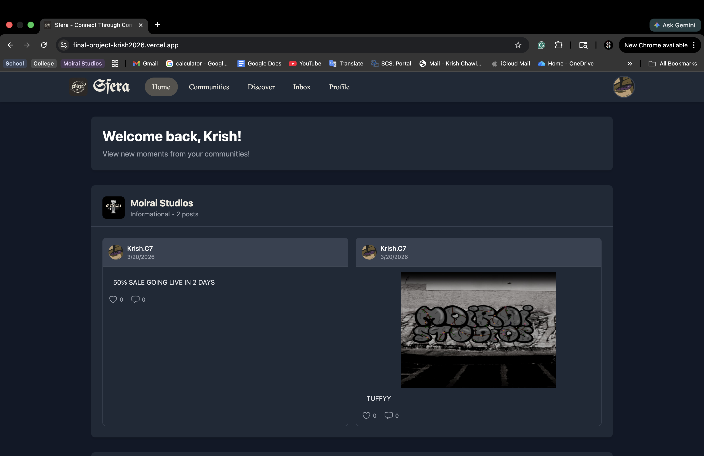
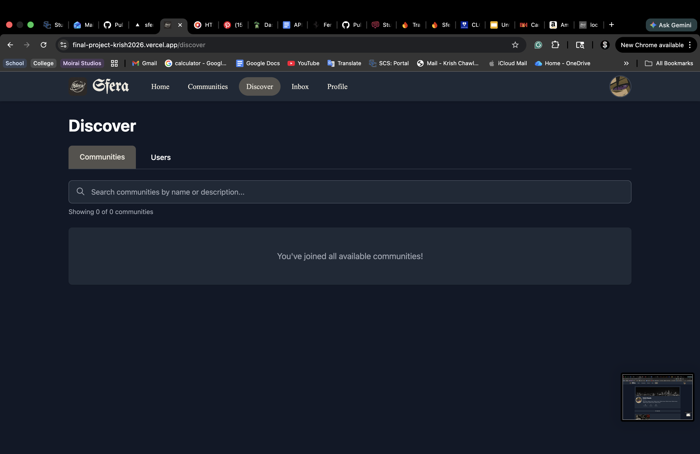
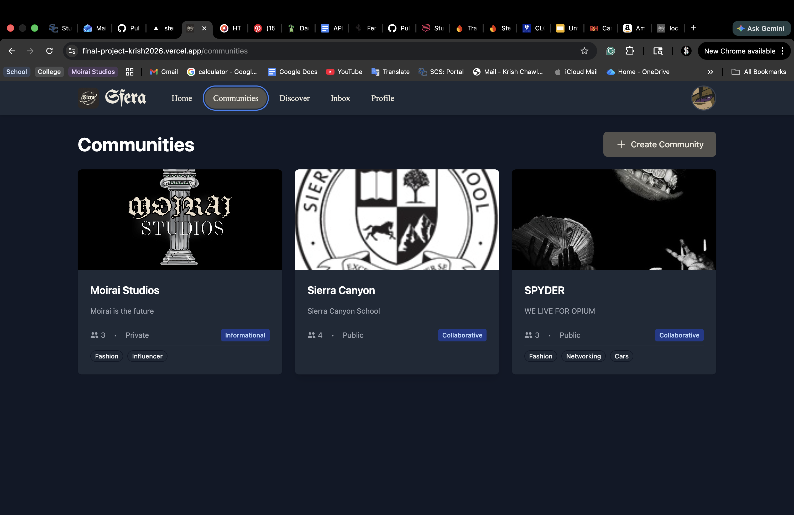
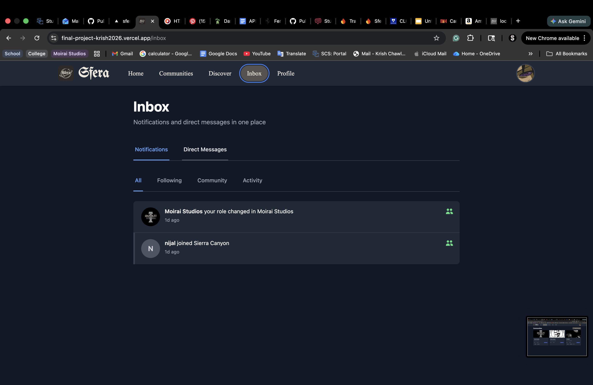
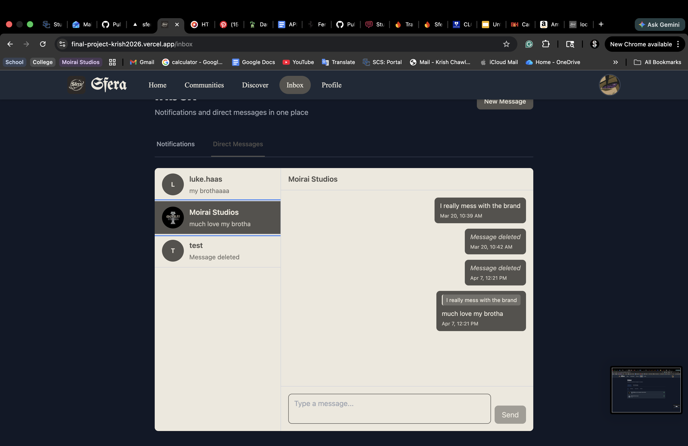

# Senior Project: React Application with GitHub Copilot

## 📋 Project Information

**Student Name:** [Krish Chawla]  
**GitHub Username:** [Krish2026]  
**Repository URL:** [https://github.com/SC-Software-Engineering2025-2026/final-project-Krish2026.git]  
**Deployed URL:** [https://final-project-krish2026.vercel.app/]

---

## 🎯 Project Overview

### Project Title

Sfera

### Project Description

[Describe your application in 2-3 paragraphs. What problem does it solve? Who is the target user? What makes it unique or valuable?]

Sfera is the future of digital communities. This application is going to be a multifaceted social media and messaging platform where people get to explore online communities to find other people who are interested in the same things they are interested in. The first thing this app will have is that each user will have their own profile where it can be private or public. Similarly to instagram, you can have posts of pictures and videos that show off who you are. Then there will be another tab where it shows all the communities that the user is in. The main selling point of this app is this "community." What does that mean? It's going to be like a digital blog page where it's either collaborative or more informational. Then each one can be public or private. What a collaborative community can look like is that there will be a home page introducing the community, a chat page where everyone in the community can talk to each other, a posts page which will have videos, pictures, and text threads, and an optional media library that will store videos and photos. An informational community would be more restrictive on what a common user cna do on the page but it would have a welcome/introduction page, a posts page where authorized users can put up videos, photos, and text threads, a messaging section where admins can have a group chat, and a separate, more private messaging section where users can message the admins as a group. The next thing this app will have is a home page for users where they can see all recent posts form the communities that they are in. There will also be a private direct messaging part that isn't a main focus but is still a feature never the less. The final page is the discover page where users can scroll through a list of public communities to see if they would like to join them. On the discover page, they can also search for both public and private communities.

A major problem this application aims to solve is that people want places where they feel like they can belong. Social media in the present day has turned into platforms where people feel like the must compete with others to have a "perfect" life. It's a toxic environment where people lose themselves in creating a fake life where they seek validation. The problem with Instagram and Tik Tok, which are the two current leading social media platforms for communities, is that there is no real way to connect larger amounts of people together under the same ideas. These platforms focus of 1 to 1 interactions where a verbal community could be made from people who like the same things. The next thing is that there are countless of communities that already exist in person such as school clubs, friend groups, athletic clubs, etc. Sfera aims to allow people to search for new communities easier, make imaginary communities of liking the same things into real, tangible communities where people can come together, and faciliate already existing communities communicate online and expand their reach. The target audience on launch would be teens ages 13-25. I think this would be the best group to launch an area for a yunger generation to start and carry trends. There is the older side of the age group that can lead the younger ones and build a path. The next group would be 40+ where the marketing would different and it would aim to digitize groups and facilitate group chats rather than carry trends. There is plenty options for everyone but marketing to each group would be significantly different based on needs.

### Motivation

[Why did you choose this project? What interests you about it? How does it connect to your personal interests or career goals?]

One reason why I chose this project is that I feel like real diverse communities don't 100% exist online, and they tend to be overran by trends and influencers. One way I saw this is that when I go to search up something either on Tik Tok or Instagram, I'm usually met with the same videos by the same influencers where I can't find real information on topics. The discovery funnel is very narrow, and I tend to be pointed more at the influencer with a lot of followers rather than the overal interest or community I'm interested in. There are platforms like Reddit or Discord that are more group based. Reddit has become very toxic and can be a rabbit hole for unethical things. Discord is more of a messaging app that catered for gamers wanting to connect on a platform where youo have to find the exact code or link to join groups. A physical community where everyone can come together and contribute to something bigger doesn't really exists, and if it does, it's not very optimal. Personally, I value the people around me and the connections I make. I have a personal goal where I want to connect myself to more parts of the world, which turned into a larger goal of wanting to connect the world to each other.

---

## 🛠️ Technical Specifications

### Core Features

- [x] **Feature 1:** Private Community page where people can post pictures, videos, and text threads
- [x] **Feature 2:** Public Community page where people can post pictures, videos, and text threads
- [x] **Feature 3:** Discover page where people can find new communities
- [x] **Feature 4:** Home page where the user has a feed of all posts from communities they already follow
- [x] **Feature 5:** Messaging system for both direct messaging and group chats
- [x] **Feature 6:** Profile pages with bio's, posts, links, and list of joined communities.

### Technology Stack

| Category                 | Technology/Library                           |
| ------------------------ | -------------------------------------------- |
| **Frontend Framework**   | React 18.x                                   |
| **UI Library**           | [e.g., Material-UI, Chakra UI, Tailwind CSS] |
| **State Management**     | Context API                                  |
| **APIs/Backend**         | Firebase                                     |
| **Routing**              | React Router                                 |
| **HTTP Client**          | Fetch API.                                   |
| **Additional Libraries** | date-fns                                     |

### User Interface Design

[Describe the main pages/views of your application and their purpose. Include wireframes or sketches if available.]

The first page will be the home page, that will look very similar to how Instagram's is, where there is a list of posts, each with captions, the user who posted it, the community it came from, a like button, a share button, and a comment section. The next page will be the communities tab where users can see all the groups and communities that they are in. Each item in the list will be fairly small with the name of the community, a profile picture, and the owner's username. Each community will overal function differently but the basics are that there will be a welcome/introduction page where there can be text, images, videos, and links describing the community; a posts page where users can view and potentially post there own pictures, videos, and text threads; a photo library where members can add photos and videos to so they cna be stored for all to see; and a group chat section where people can message each other. The last page will be the user's profile page where they can view and edit their profile. Each profile will consist of a bio, a profile image, the user's username and real name, a string of pictures that the user can upload to present themselves, a list of all the communities a person is in, and a "recent posts" section where people can see the most recent public posts a user has made.

**Main Views:**

1. Home - Display recent posts from communities that the user is a part of.
2. Communities - Display list of all communities that the user has joined.
3. Discover - Consists of a serach engine where the user can either search for communities to join or for users.
4. Inbox - Displays all notifications that the user gets. There is a second sub-tab with a messaging system where suers get to privately DM each other.
5. Profile - Displays the current user profile which consists of a profile picture, a banner image, the user's real name, the username, the bio, the communities the user has joined, the users that the user follow, the users that follow the user, and extra images that builds the user's profile.

### Data Management

[Explain how your application will handle data. What data needs to be stored? Will you use local storage, a database, or external APIs?]

All data handling will be done through Firebase. User log-in and authentication will be handled through Firebase's authentication functionality. Data storage such as total users, community lists and data, etc. will be stored and managed through Firebase's firestore. Then, all image, video, and file uploads will be stored and handled through Firebase's storage system.

---

## 🤖 GitHub Copilot Integration

### Planned Use Cases

- [x] Component scaffolding and boilerplate code
- [x] API integration and data fetching logic
- [x] Writing unit tests

---

## 📅 Project Timeline & Milestones

### Milestone 1: Project Setup ✅

**Target Date:** [Date]

**Deliverables:**

- [x] Initialize React project
- [x] Set up GitHub repository
- [x] Configure GitHub Copilot
- [x] Create basic project structure

---

### Milestone 2: Core Features 🚧

**Target Date:** [Date]

**Deliverables:**

- [x] Home page functionality with displaying different posts
- [x] Community pages with a welcome page, post page, chat page, media upload page, and settings
- [x] Profile Creation with user data storage
- [x] Create a post functionality with captions, video and image upload, and hashtags

---

### Milestone 3: UI/UX Polish 📋

**Target Date:** [Date]

**Deliverables:**

- [x] [UI improvement task]
- [x] [Styling task]
- [x] [Responsive design implementation]
- [x] [Accessibility improvements]

---

### Milestone 4: Testing & Deployment 🚀

**Target Date:** [Date]

**Deliverables:**

- [x] Write and run tests
- [x] Fix bugs and optimize performance
- [x] Deploy to hosting platform
- [x] Prepare final presentation

---

## ✅ Success Criteria

- [x] All core features are functional
- [x] Application is deployed and accessible online
- [x] Code is well-documented with clear comments

---

## 🚀 Getting Started

### Prerequisites

```bash
Node.js (v16 or higher)
npm or yarn
Git
```

### Installation

1. Clone the repository

```bash
git clone [your-repo-url]
cd [your-project-name]
```

2. Install dependencies

```bash
npm install
# or
yarn install
```

3. Set up environment variables

```bash
touch .env
# Edit .env with your configuration
```

4. Start the development server

```bash
npm start
# or
yarn start
```

5. Open [http://localhost:3000](http://localhost:3000) in your browser

---

## 📁 Project Structure

```
project-root/
├── public/
│   ├── index.html
│   └── assets/
├── src/
│   ├── components/
│   │   ├── [Component1]/
│   │   ├── [Component2]/
│   │   └── ...
│   ├── pages/
│   │   ├── [Page1].jsx
│   │   └── [Page2].jsx
│   ├── hooks/
│   ├── context/
│   ├── services/
│   ├── utils/
│   ├── App.jsx
│   └── index.js
├── package.json
└── README.md
```

---

## 🧪 Testing

[Describe your testing approach]

```bash
# Run tests
npm test

# Run tests with coverage
npm test -- --coverage
```

---

## 🌐 Deployment

[Describe your deployment process and platform]

I deployed my website to vercel. The linking process was fairly simple where i connected my github account and was able to pick my application. I then had to merge my development branch to my main so that all pushed commits reflect in my application. Then I had to input all my firebase API variables into the environment settings so that vercel can connect to it. Then I added the domain to my authentication in firebase so that user authentication works, especially with google log in as well.

**Deployment Platform:** [Vercel]

**Live URL:** [https://final-project-krish2026.vercel.app/]

---

## 📸 Screenshots

[Add screenshots of your application once developed]

### Home Page



### [Feature Name]








---

## 🎓 Reflections & Learnings

### What I Learned

What I learned from this project is how to work with an AI chat bot model, how to bettern communicate, how to incorperate firebase into a larger project, and how to start up my own project where it then can be deployed into a real application. Starting the application was difficult because I didn't really know where to start and how. I learned that AI is good at taking information and forming it into real thoughts to plug back into itself to code. Learning to connect other things like firebase, google auth, and vercel with having to need the API's and everyting to truly connect them taught me that AI can't do everything. Leaning more into that, I learned that AI isn't going to do literally everything for me. I can't just give it a single prompt and have it done in 1 hour. I have to break down the prompt into certain parts and give very specific direction in context of my app. Especially when switching into different chats, since the new chat won't have the same context, I would have had to explain the last context to keep going. I learned how to communicate properly with AI through that where I had to get my thoughts down on paper in an understandable way. AI was only there as a tool to do the heavy lifting of the laborious coding and does not replace me as the programmer.

### Challenges Faced

My first significant challenge came when I started the application. I'm used to having a template and base to work off of where I just get to clone a set up project. But actually creating a structure and base, connecting it to github, and linking firebase took some time for me. I had to go back to old projects and see how to do it all. I also got a lot of insight from copilot where it told me step by step how to set some things up. My next challenge came in different forms. There were some tasks such as the messaging system, the privacy functionality, the saving of user profile and community profile data in a database, and many others that were simply too much for the AI to handle. It would take many "continues" and many consecutive prompts to figure it out where after it would "change code," nothing would have actually changed. I was able to fix a lot of the with better prompting that came in the form of both having more clear instructions of what I want, and also debugging the app myself then telling copilot what the exact error is and having it help me fix it. However, some features I had to ditch all together because I simply could not figure them out in time such as the user tagging on posts. At one point I had it working completely. Then I broke something else unrelated and went back a commit where I hadn't commited that new code. I thought I couldve just asked copilot to do it again, however, I never was able to get the tagging to work again even thought I had all the pieces.

### GitHub Copilot Experience

I feel like GitHub Copilot played a dual role throughout this project where it proved to be genuinely useful in some areas while revealing clear limitations in others. On the helpful side, Copilot was amazing during the initial setup phase, as well as future set ups with outside programs like firebase. Since starting a project from scratch without a template or base was unfamiliar territory, copilot provided step-by-step guidance on how to structure the application, connect it to GitHub, and link firebase. This kind of foundational orientation helped bridge the gap when prior projects could only offer so much reference. I was able to to try new forms of implementation and fully get a new form of real world knowledge. However, copilot's limitations became apparent quickly when the complexity of the tasks increased. Features like the messaging system, privacy functionality, and saving user and community profile data to a database proved to be too involved for Copilot to handle effectively. Prompts would require numerous "continues" and follow-up messages, and after Copilot claimed to have changed code, nothing would have actually been modified. This was a recurring frustration that cost significant time. I would find myself being stuck on what felt like simple tasks of a small feature for hours on end, trying to find a solution. The experience did lead to an important skill: learning how to communicate with AI more effectively. Rather than issuing broad, vague prompts, breaking tasks down into specific, context-rich instructions yielded far better results. Debugging the application independently first, then feeding Copilot the exact error, became a much more productive workflow than relying on it to diagnose problems on its own. Perhaps the most telling example of Copilot's limits was the user tagging feature. It had been fully implemented at one point, but after reverting to an earlier commit where that code hadn't been saved, Copilot was never able to recreate it, even with all the relevant context available. The feature had to be scrapped entirely. This illustrated that Copilot is a tool for handling the heavy lifting of laborious coding, not a replacement for the programmer's judgment, memory, or problem-solving ability.

### Future Improvements

I believe Sfera is in a very good state of what it's able to do, but there are a lot more features I wouldv'e loved to add. The main overal features I would lvoe to add would be more security checking legal acknoledgements to make the company a legit business as well as ensure user safety. I also want to add a moderation system through an algorithm that would check the social safety of posts, chats, and messages throughout the app to ensure a firendly user environment. As for more technical featuresm I want to add more features to the communities such as ways to tag people in posts and comment sections. I want better image handling and data transfer. I want a better notification system that more accurately describes what happens in a organized way for all features of the application. I currently have good ones for my more basic features, but I would love to add higher quality ones. I also want to add a way for the user to change their email and password while they're logged in, as well as set up a way for users to reset their password if they forgot it. Something like that would require more authentication steps so people can't steal accounts via email. I think my main concerns for the future woul dbe to add more security to the app as well as increase the overal quality of it to make it as safe and smooth proccess as it can be.

---

## 📚 Resources & References

- [React Documentation](https://react.dev)
- [GitHub Copilot Documentation](https://docs.github.com/copilot)
- [Other resource]
- [Other resource]

---

# 📊 Grading Rubric

## Total Points: 100

### 1. Project Planning & Documentation (20 points)

| Criteria               | Excellent (5)                                      | Good (4)                                | Fair (3)                             | Poor (1-2)               |
| ---------------------- | -------------------------------------------------- | --------------------------------------- | ------------------------------------ | ------------------------ |
| **Project Proposal**   | Complete, clear, well-thought-out proposal         | Mostly complete with minor gaps         | Basic proposal with significant gaps | Incomplete or unclear    |
| **README.md**          | Professional, comprehensive, includes all sections | Good documentation with minor omissions | Basic documentation                  | Minimal or missing       |
| **Code Comments**      | Clear, helpful comments throughout                 | Good comments on complex sections       | Some comments present                | Few or no comments       |
| **Milestone Tracking** | All milestones met on time                         | Most milestones met with minor delays   | Several milestones delayed           | Poor milestone adherence |

---

### 2. Technical Implementation (35 points)

| Criteria                            | Excellent (9-10)                                  | Good (7-8)                                      | Fair (5-6)                                | Poor (1-4)            |
| ----------------------------------- | ------------------------------------------------- | ----------------------------------------------- | ----------------------------------------- | --------------------- |
| **React Components**                | Well-structured, reusable, follows best practices | Good structure with minor issues                | Basic components with some poor practices | Poorly structured     |
| **State Management**                | Effective state management throughout             | Good state management with minor inefficiencies | Basic state management                    | Poor state handling   |
| **API Integration / Data Handling** | Robust error handling, efficient data flow        | Good implementation with minor gaps             | Basic implementation                      | Incomplete or buggy   |
| **Code Quality & Organization**     | Clean, organized, follows conventions             | Mostly clean and organized                      | Some organization issues                  | Messy or disorganized |

---

### 3. Feature Completion & Functionality (25 points)

| Criteria                | Excellent (9-10)                           | Good (7-8)                            | Fair (5-6)                        | Poor (1-4)                      |
| ----------------------- | ------------------------------------------ | ------------------------------------- | --------------------------------- | ------------------------------- |
| **Core Features**       | All features fully implemented and working | Most features working with minor bugs | Some features incomplete or buggy | Many missing or broken features |
| **User Experience**     | Intuitive, smooth, professional            | Good UX with minor usability issues   | Functional but not polished       | Poor or confusing UX            |
| **Testing & Bug Fixes** | Thorough testing, minimal bugs             | Good testing, few minor bugs          | Some testing, several bugs        | Little testing, many bugs       |

---

### 4. GitHub Copilot Usage & Learning (10 points)

| Criteria                     | Excellent (5)                                                 | Good (4)                    | Fair (3)                         | Poor (1-2)                  |
| ---------------------------- | ------------------------------------------------------------- | --------------------------- | -------------------------------- | --------------------------- |
| **Effective Use of Copilot** | Strategic use, understands suggestions, improves productivity | Good use with some reliance | Basic use, limited understanding | Minimal or blind acceptance |
| **Code Understanding**       | Can explain all code, modifies suggestions appropriately      | Understands most code       | Limited understanding            | Cannot explain code         |

---

### 5. Presentation & Deployment (10 points)

| Criteria               | Excellent (5)                                    | Good (4)                            | Fair (3)                             | Poor (1-2)                     |
| ---------------------- | ------------------------------------------------ | ----------------------------------- | ------------------------------------ | ------------------------------ |
| **Final Presentation** | Clear, engaging, demonstrates deep understanding | Good presentation with minor issues | Basic presentation                   | Unclear or unprepared          |
| **Deployment**         | Successfully deployed, fully functional online   | Deployed with minor issues          | Deployed but with significant issues | Not deployed or non-functional |

---

# 🎯 Detailed Milestone Guide

## Milestone 1: Project Initiation & Planning (Week 1-2)

### Deliverables

- ✅ Completed project proposal document
- ✅ GitHub repository created with initial README
- ✅ React project initialized with basic folder structure
- ✅ GitHub Copilot configured and tested
- ✅ Wireframes or mockups of main views

### Success Criteria

- Clear project scope and feature list defined
- Development environment fully set up
- Can successfully create and commit code to GitHub

---

## Milestone 2: Core Functionality Development (Week 3-5)

### Deliverables

- 🔲 Basic component structure implemented
- 🔲 At least 2-3 core features working
- 🔲 State management implemented
- 🔲 API integration or data handling in place
- 🔲 Regular commits showing progress

### Success Criteria

- Application demonstrates core concept/purpose
- Components are reusable and well-organized
- Data flows correctly through the application

---

## Milestone 3: Feature Completion & UI Polish (Week 6-8)

### Deliverables

- 🔲 All planned features implemented
- 🔲 UI styled with chosen library or CSS framework
- 🔲 Responsive design working on mobile and desktop
- 🔲 Error handling and loading states implemented
- 🔲 Code comments and documentation added

### Success Criteria

- Application looks professional and polished
- User experience is intuitive and smooth
- No major bugs in core functionality

---

## Milestone 4: Testing, Optimization & Deployment (Week 9-10)

### Deliverables

- 🔲 Comprehensive testing completed
- 🔲 All known bugs fixed
- 🔲 Performance optimized
- 🔲 Application deployed to hosting platform (Vercel, Netlify, etc.)
- 🔲 README updated with deployment URL and instructions

### Success Criteria

- Application is live and accessible via URL
- All features work correctly in production
- Documentation is complete and accurate

---

## Milestone 5: Final Presentation (Week 11)

### Deliverables

- 🔲 Presentation slides or demo prepared
- 🔲 Live demonstration of application
- 🔲 Code walkthrough highlighting key components
- 🔲 Discussion of GitHub Copilot usage and lessons learned
- 🔲 Reflection on challenges and solutions

### Presentation Requirements (10-15 minutes)

1. Project overview and motivation
2. Live demo of key features
3. Technical highlights and interesting code
4. How GitHub Copilot helped (with specific examples)
5. Challenges faced and how you overcame them
6. What you learned and future improvements

---

# 💡 Tips for Success

## GitHub Best Practices

- ✅ Commit regularly with clear, descriptive messages
- ✅ Use branches for new features
- ✅ Write a comprehensive README with setup instructions
- ✅ Include a .gitignore file to exclude node_modules and sensitive data
- ✅ Use meaningful branch names (feature/user-auth, bugfix/login-error)

## Working with GitHub Copilot

- ✅ Always review and understand suggested code before accepting
- ✅ Use comments to guide Copilot toward desired solutions
- ✅ Test all code thoroughly, especially AI-generated suggestions
- ✅ Modify suggestions to match your project's style and needs
- ✅ Document interesting or non-obvious code sections
- ⚠️ Don't blindly accept suggestions - understand what the code does
- ⚠️ Be aware of potential security issues in generated code

## Time Management

- ⏰ Start early and work consistently
- ⏰ Build incrementally - get one feature working before moving to the next
- ⏰ Test frequently to catch issues early
- ⏰ Leave time for polish and deployment
- ⏰ Ask for help when stuck - don't wait until the last minute

## Code Quality

- 📝 Write clean, readable code
- 📝 Follow consistent naming conventions
- 📝 Keep components small and focused
- 📝 Extract reusable logic into custom hooks
- 📝 Handle errors gracefully
- 📝 Add loading states for async operations

---

# 🔗 Helpful Resources

## React

- [React Official Documentation](https://react.dev)
- [React Hooks Documentation](https://react.dev/reference/react)
- [React Router Documentation](https://reactrouter.com)

## GitHub Copilot

- [GitHub Copilot Documentation](https://docs.github.com/copilot)
- [Getting Started with Copilot](https://docs.github.com/copilot/getting-started-with-github-copilot)

## Deployment Platforms

- [Vercel](https://vercel.com)
- [Netlify](https://netlify.com)
- [GitHub Pages](https://pages.github.com)
- [Render](https://render.com)

## UI Libraries & Styling

- [Tailwind CSS](https://tailwindcss.com)
- [Material-UI](https://mui.com)
- [Chakra UI](https://chakra-ui.com)
- [React Bootstrap](https://react-bootstrap.github.io)

## Additional Tools

- [Axios](https://axios-http.com) - HTTP client
- [React Query](https://tanstack.com/query) - Data fetching
- [Zustand](https://zustand-demo.pmnd.rs) - State management
- [React Hook Form](https://react-hook-form.com) - Form handling

---

## 📞 Getting Help

If you encounter issues:

1. Check the documentation for the library/tool you're using
2. Search Stack Overflow for similar problems
3. Ask GitHub Copilot for suggestions (but verify the code!)
4. Discuss with classmates (collaboration is encouraged!)

---

**Good luck with your project! 🚀**
